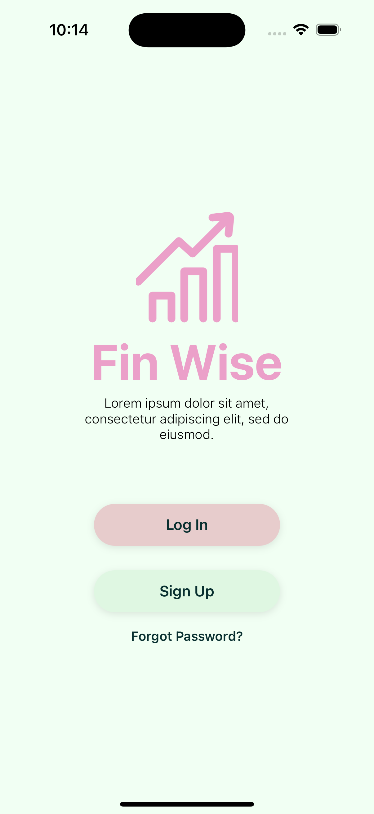
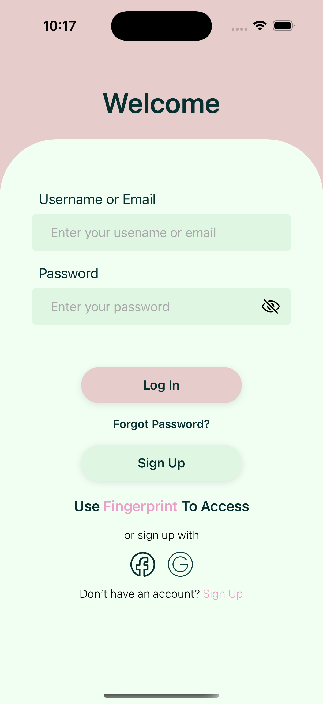
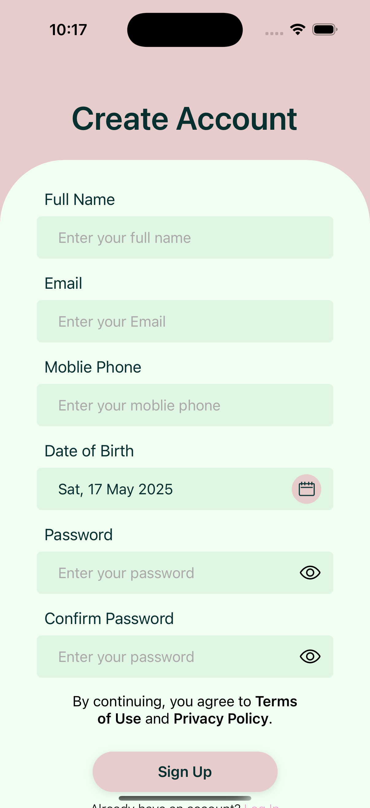
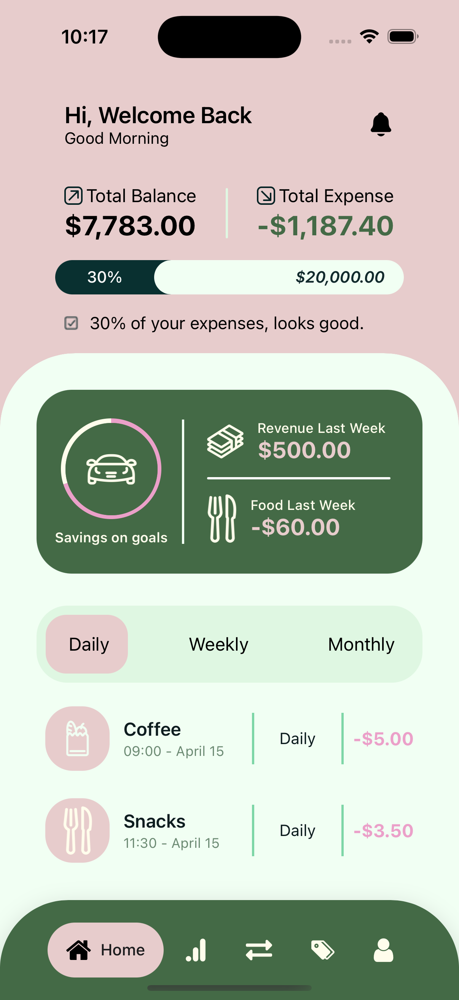
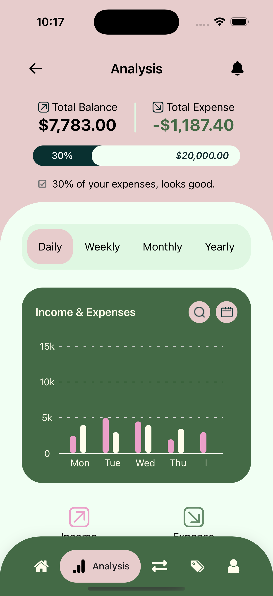
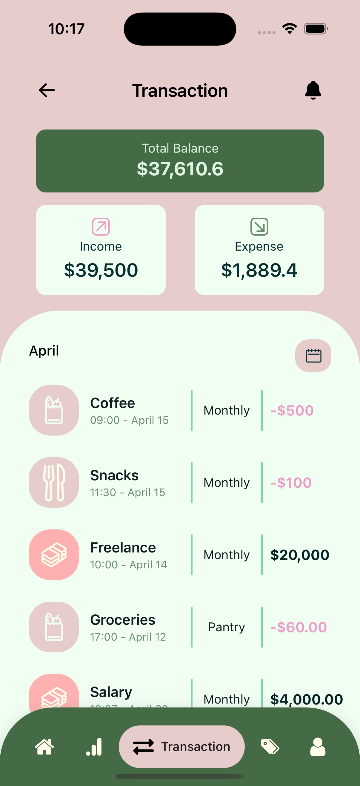
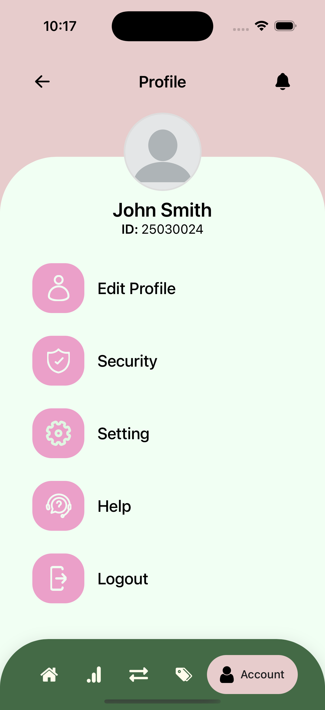

# FinWise - Finance Management Mobile App UI 👋

FinWise is a **UI-only React Native project** that recreates the interface of a personal finance management mobile app. This project focuses solely on front-end design and **does not include backend functionality or real data handling**. All screens are based on a community Figma design.

## ✨ Original Figma Design

- [View on Figma - FinWise app](https://www.figma.com/design/NVtAFKkbzqeinlOMeyYTCP/Finance-Management-Mobile-App-UI-UX-Kit-for-Budget-Tracker-Financial-Prototype-Design--Community-?node-id=7020-3430&t=kuVKjNYZlLlCwIwu-1)

## 📱 Available Screens

- **Launch Screen** – App splash screen
- **Onboarding Screens** – Introduction flow for new users
- **Login Screen** – Sign in to your account
- **Signup Screen** – Create a new account
- **Forgot Password Screen** – Reset your password
- **Home Screen** – Financial overview
- **Analysis Screen** – Spending analytics
- **Category Screen** – Manage or view spending categories
- **Transaction Screen** – List of income/expenses
- **User Profile Screen** – User information and settings

## 🖼️ Screenshots

| Launch                                        | Login | Signup |
| --------------------------------------------- | ----- | ------ |
|  |
|    |
|  |

| OnBoarding                                              | Home | Analysis |
| ------------------------------------------------------- | ---- | -------- |
|  |
|               |
|        |

| Transaction                                             | Category | Profile |
| ------------------------------------------------------- | -------- | ------- |
|  |
|        |
|          |

> Screenshots are from actual UI implementation based on the Figma design.

## 🛠 Tech Stack

- **React Native (via Expo)**
- **Expo CLI**
- **JavaScript**
- **React Navigation**
- **Styled Components / Custom Styles**

## 👩🏻‍💻 Get started

1. Clone the repository:

   ```bash
   git clone https://github.com/pnhoanganh/FinWise-app.git
   ```

2. Navigate to the project folder:
   ```bash
    cd FinWise-app
   ```
3. Install dependencies:

   ```bash
    npm install
   ```

4. Start the development server:
   ```bash
   npx expo start
   ```
